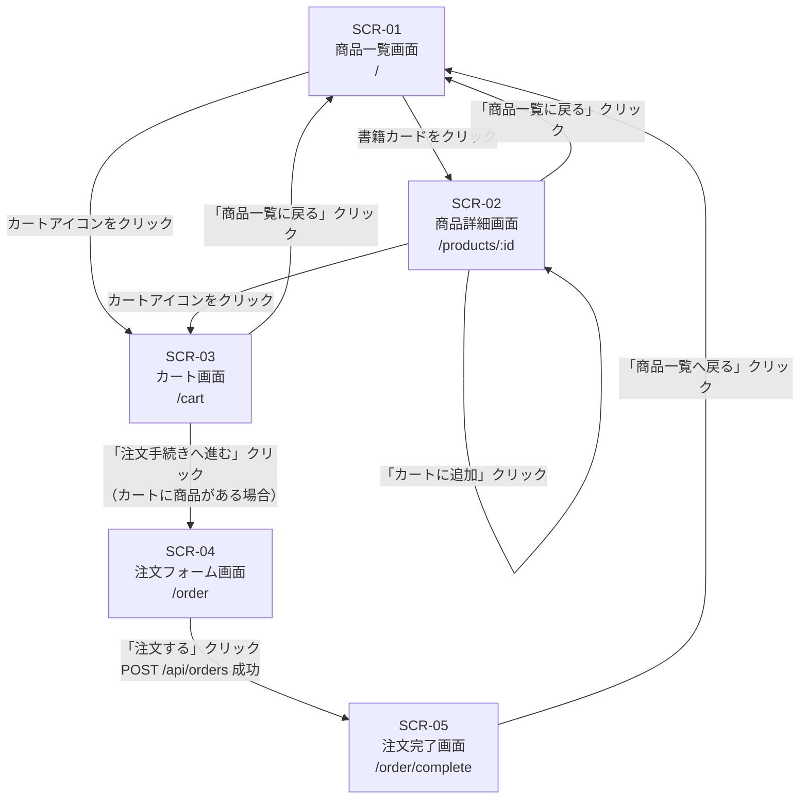
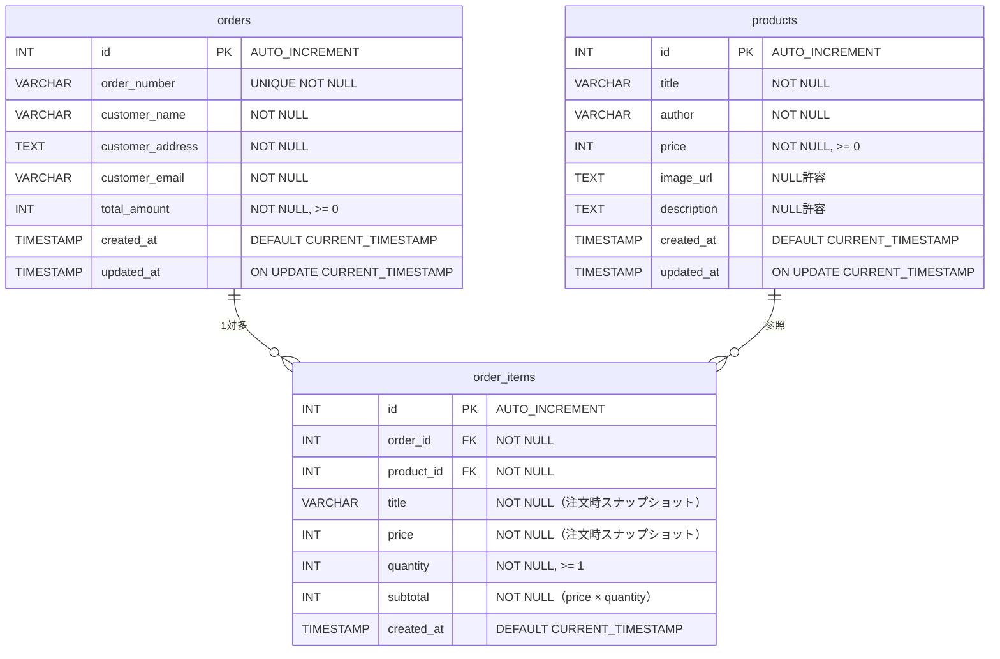

# 外部設計書

## 1. ドキュメント情報

| 項目 | 内容 |
|---|---|
| ドキュメント名 | 外部設計書（個人運営オンライン書店 購買フロー） |
| 作成日 | 2026-05-12 |
| バージョン | 1.0.0 |
| 対象システム名 | 個人運営オンライン書店 購買フローWebアプリケーション |
| 参照要件定義書 | user_requirements.md |
| 作成者 | （設計担当者） |

---

## 2. システム概要

### 2.1 システムの目的と背景

本システムは、個人が運営するオンライン書店における購買フローを実現するWebアプリケーションである。ユーザーが書籍を探し、カートに追加し、配送情報を入力して注文を完了するまでの一連の操作をブラウザ上で完結できる。

認証・決済・在庫管理は本システムのスコープ外とし、購買体験のコアフローに特化した実装とする。

### 2.2 システム全体像

```
┌─────────────────────────────────────────────────────────────┐
│                         ユーザーブラウザ                         │
│                   http://localhost:3000                      │
└───────────────────────────┬─────────────────────────────────┘
                            │ HTTP / REST (JSON)
                            │ NEXT_PUBLIC_API_URL
                            │ (デフォルト: http://localhost:4000)
┌───────────────────────────▼─────────────────────────────────┐
│                   Frontendサービス                             │
│              Next.js 14 + TypeScript                         │
│               App Router (src/app/)                          │
└───────────────────────────┬─────────────────────────────────┘
                            │ fetch / axios
┌───────────────────────────▼─────────────────────────────────┐
│                   Backendサービス                              │
│              Express + TypeScript                            │
│             (backend/src/index.ts, port 4000)               │
└───────────────────────────┬─────────────────────────────────┘
                            │ mysql2 / ORM
┌───────────────────────────▼─────────────────────────────────┐
│                   データベースサービス                            │
│                  MySQL 8                                     │
│           初期化SQL: mysql/init/01_init.sql                   │
└─────────────────────────────────────────────────────────────┘
            Docker Compose で3サービスを統合管理
```

### 2.3 スコープ

#### 対象範囲

| 機能 | 説明 |
|---|---|
| 商品一覧表示 | 販売中書籍のグリッド一覧 |
| 商品詳細表示 | 書籍の詳細情報表示 |
| カート管理 | カートへの追加・数量変更・削除 |
| 注文フォーム | 配送先情報入力・注文内容確認 |
| 注文完了 | 注文受付確認・注文番号表示 |

#### 対象外範囲

| 機能 | 除外理由 |
|---|---|
| ログイン・会員管理 | 本購買フローに不要 |
| 決済処理 | スコープ外 |
| 在庫管理 | スコープ外 |
| 管理画面 | スコープ外 |
| レビュー・評価 | スコープ外 |
| 検索・フィルター | スコープ外 |
| 送料計算 | スコープ外（合計金額のみ表示） |

---

## 3. 画面設計

### 3.1 画面一覧

| 画面ID | 画面名 | URL | App Routerパス | 概要 |
|---|---|---|---|---|
| SCR-01 | 商品一覧画面 | `/` | `src/app/page.tsx` | 販売中書籍をグリッド形式で表示 |
| SCR-02 | 商品詳細画面 | `/products/[id]` | `src/app/products/[id]/page.tsx` | 書籍の詳細情報を表示、カートへの追加 |
| SCR-03 | カート画面 | `/cart` | `src/app/cart/page.tsx` | カート内商品の確認・数量変更・削除 |
| SCR-04 | 注文フォーム画面 | `/order` | `src/app/order/page.tsx` | 配送先入力・注文内容確認・注文確定 |
| SCR-05 | 注文完了画面 | `/order/complete` | `src/app/order/complete/page.tsx` | 注文完了メッセージ・注文番号表示 |

---

### 3.2 SCR-01 商品一覧画面

**対応要件:** U-01, U-02, U-03

#### 3.2.1 画面レイアウト概要

```
┌──────────────────────────────────────────┐
│  ヘッダー: サイト名                カートアイコン │
├──────────────────────────────────────────┤
│  h1: 商品一覧                             │
│                                          │
│  ┌────────┐ ┌────────┐ ┌────────┐        │
│  │ 書影   │ │ 書影   │ │ 書影   │        │
│  │ タイトル│ │ タイトル│ │ タイトル│        │
│  │ 著者名 │ │ 著者名 │ │ 著者名 │        │
│  │ ¥価格  │ │ ¥価格  │ │ ¥価格  │        │
│  └────────┘ └────────┘ └────────┘        │
│  （グリッド繰り返し）                      │
└──────────────────────────────────────────┘
```

#### 3.2.2 表示項目一覧

| 項目名 | データ型 | 必須/任意 | 説明 |
|---|---|---|---|
| 書影 | 画像URL | 任意 | 書籍のカバー画像。未設定時はプレースホルダー表示 |
| タイトル | 文字列 | 必須 | 書籍タイトル |
| 著者名 | 文字列 | 必須 | 著者名 |
| 価格 | 数値（円） | 必須 | 税込み価格を「¥X,XXX」形式で表示 |

#### 3.2.3 操作・イベント一覧

| 操作 | トリガー | 処理内容 |
|---|---|---|
| 書籍カードクリック | click | 商品詳細画面（SCR-02）へ遷移 |
| カートアイコンクリック | click | カート画面（SCR-03）へ遷移 |
| ページ初期表示 | onMount | `GET /api/products` を呼び出し書籍一覧を取得 |

#### 3.2.4 画面遷移先

| 遷移先 | 条件 |
|---|---|
| SCR-02 商品詳細画面 | 書籍カードをクリック |
| SCR-03 カート画面 | カートアイコンをクリック |

#### 3.2.5 バリデーションルール

なし（表示専用画面）

---

### 3.3 SCR-02 商品詳細画面

**対応要件:** U-04, U-05, U-06

#### 3.3.1 画面レイアウト概要

```
┌──────────────────────────────────────────┐
│  ヘッダー: サイト名                カートアイコン │
├──────────────────────────────────────────┤
│  ← 商品一覧に戻る                          │
│                                          │
│  ┌──────────┐  タイトル                    │
│  │          │  著者名                      │
│  │  書影    │  ¥価格                       │
│  │          │                             │
│  │          │  [カートに追加]ボタン          │
│  └──────────┘                             │
│                                          │
│  ─── 商品説明 ─────────────────────────── │
│  説明文テキスト                             │
└──────────────────────────────────────────┘
```

#### 3.3.2 表示項目一覧

| 項目名 | データ型 | 必須/任意 | 説明 |
|---|---|---|---|
| 書影 | 画像URL | 任意 | 書籍カバー画像。未設定時はプレースホルダー表示 |
| タイトル | 文字列 | 必須 | 書籍タイトル |
| 著者名 | 文字列 | 必須 | 著者名 |
| 価格 | 数値（円） | 必須 | 税込み価格を「¥X,XXX」形式で表示 |
| 説明文 | 文字列 | 任意 | 書籍の概要・紹介文。未設定時は非表示 |

#### 3.3.3 操作・イベント一覧

| 操作 | トリガー | 処理内容 |
|---|---|---|
| ページ初期表示 | onMount | `GET /api/products/:id` を呼び出し書籍詳細を取得 |
| 「カートに追加」ボタンクリック | click | カートにその書籍を数量1で追加。カートはブラウザのlocalStorageで管理（[前提A]参照）。成功後、「商品一覧に戻る」リンクを表示したままにする |
| 「商品一覧に戻る」リンククリック | click | SCR-01 商品一覧画面へ遷移 |
| カートアイコンクリック | click | SCR-03 カート画面へ遷移 |

#### 3.3.4 画面遷移先

| 遷移先 | 条件 |
|---|---|
| SCR-01 商品一覧画面 | 「商品一覧に戻る」リンクをクリック |
| SCR-03 カート画面 | カートアイコンをクリック |

#### 3.3.5 バリデーションルール

なし（表示・カート追加操作のみ）

---

### 3.4 SCR-03 カート画面

**対応要件:** U-07, U-08, U-09, U-10, U-11

#### 3.4.1 画面レイアウト概要

```
┌──────────────────────────────────────────┐
│  ヘッダー: サイト名                カートアイコン │
├──────────────────────────────────────────┤
│  h1: カート                               │
│                                          │
│  ┌────────────────────────────────────┐  │
│  │ 書名    単価    数量[−][数量][＋]  小計  [削除] │
│  │ 書名    単価    数量[−][数量][＋]  小計  [削除] │
│  └────────────────────────────────────┘  │
│                         合計: ¥X,XXX     │
│                                          │
│  ← 商品一覧に戻る  [注文手続きへ進む]        │
└──────────────────────────────────────────┘
```

#### 3.4.2 表示項目一覧

| 項目名 | データ型 | 必須/任意 | 説明 |
|---|---|---|---|
| 書名 | 文字列 | 必須 | カート内書籍のタイトル |
| 単価 | 数値（円） | 必須 | 1冊あたりの価格（「¥X,XXX」形式） |
| 数量 | 整数 | 必須 | カートに入れている冊数（1以上） |
| 小計 | 数値（円） | 必須 | 単価 × 数量（「¥X,XXX」形式）。数量変更時にリアルタイム更新 |
| 合計金額 | 数値（円） | 必須 | カート内全商品の小計合計（「¥X,XXX」形式）。増減・削除時にリアルタイム更新 |

#### 3.4.3 操作・イベント一覧

| 操作 | トリガー | 処理内容 |
|---|---|---|
| ページ初期表示 | onMount | localStorageからカート情報を読み込み表示 |
| 数量「＋」ボタンクリック | click | 対象商品の数量を+1。小計・合計を即時再計算 |
| 数量「−」ボタンクリック | click | 対象商品の数量を-1。数量が1の場合は操作不可（または0にして自動削除は[前提B]参照）。小計・合計を即時再計算 |
| 「削除」ボタンクリック | click | 対象商品をカートから削除。合計金額を即時更新 |
| 「注文手続きへ進む」ボタンクリック | click | SCR-04 注文フォーム画面へ遷移。カートが空の場合はボタン非活性または警告表示 |
| 「商品一覧に戻る」リンククリック | click | SCR-01 商品一覧画面へ遷移 |

#### 3.4.4 画面遷移先

| 遷移先 | 条件 |
|---|---|
| SCR-04 注文フォーム画面 | 「注文手続きへ進む」ボタンクリック（カートに商品がある場合） |
| SCR-01 商品一覧画面 | 「商品一覧に戻る」リンクをクリック |

#### 3.4.5 バリデーションルール

| 項目 | ルール |
|---|---|
| 数量 | 1以上の整数のみ。0以下への変更は不可 |
| 注文手続きへの遷移 | カートが空の場合は「注文手続きへ進む」ボタンを非活性にする |

---

### 3.5 SCR-04 注文フォーム画面

**対応要件:** U-12, U-13, U-14, U-15

#### 3.5.1 画面レイアウト概要

```
┌──────────────────────────────────────────┐
│  ヘッダー: サイト名                カートアイコン │
├──────────────────────────────────────────┤
│  h1: 注文フォーム                          │
│                                          │
│  ┌─ 注文内容確認 ──────────────────────┐   │
│  │ 書名         数量   小計            │   │
│  │ 書名         数量   小計            │   │
│  │                    合計: ¥X,XXX   │   │
│  └────────────────────────────────────┘  │
│                                          │
│  ┌─ お届け先情報 ───────────────────────┐  │
│  │  氏名 *        [________________] │  │
│  │  住所 *        [________________] │  │
│  │  メールアドレス * [________________] │  │
│  └────────────────────────────────────┘  │
│                                          │
│              [注文する]                   │
└──────────────────────────────────────────┘
```

#### 3.5.2 表示項目一覧

**注文内容確認エリア（表示専用）**

| 項目名 | データ型 | 必須/任意 | 説明 |
|---|---|---|---|
| 書名 | 文字列 | 必須 | カート内書籍のタイトル |
| 数量 | 整数 | 必須 | 注文冊数 |
| 小計 | 数値（円） | 必須 | 単価 × 数量 |
| 合計金額 | 数値（円） | 必須 | 全商品の小計合計 |

**お届け先入力エリア**

| 項目名 | データ型 | 必須/任意 | 最大文字数 | 説明 |
|---|---|---|---|---|
| 氏名 | 文字列 | 必須 | 100文字 | 配送先の受取人氏名 |
| 住所 | 文字列 | 必須 | 255文字 | 配送先の住所（都道府県〜番地） |
| メールアドレス | 文字列（email形式） | 必須 | 255文字 | 注文確認メール送信先（[前提C]） |

#### 3.5.3 操作・イベント一覧

| 操作 | トリガー | 処理内容 |
|---|---|---|
| ページ初期表示 | onMount | localStorageからカート情報を読み込み注文内容エリアに表示 |
| 「注文する」ボタンクリック | click | バリデーション実行 → 成功時は `POST /api/orders` を呼び出し → 成功時はlocalStorageのカートを空にしてSCR-05へ遷移 |
| 入力フォームのフォーカスアウト | blur | 各フィールドのバリデーションを実行し、エラーがあればメッセージを表示 |

#### 3.5.4 画面遷移先

| 遷移先 | 条件 |
|---|---|
| SCR-05 注文完了画面 | 「注文する」ボタンクリック後、APIが正常レスポンスを返した場合 |

#### 3.5.5 バリデーションルール

| フィールド | ルール | エラーメッセージ |
|---|---|---|
| 氏名 | 必須・最大100文字 | 「氏名を入力してください」「氏名は100文字以内で入力してください」 |
| 住所 | 必須・最大255文字 | 「住所を入力してください」「住所は255文字以内で入力してください」 |
| メールアドレス | 必須・RFC5322準拠のメール形式・最大255文字 | 「メールアドレスを入力してください」「有効なメールアドレスを入力してください」 |

---

### 3.6 SCR-05 注文完了画面

**対応要件:** U-16, U-17, U-18

#### 3.6.1 画面レイアウト概要

```
┌──────────────────────────────────────────┐
│  ヘッダー: サイト名                カートアイコン │
├──────────────────────────────────────────┤
│                                          │
│        ご注文ありがとうございます              │
│                                          │
│       注文番号: ORD-XXXXXXXXXX            │
│                                          │
│    ご注文内容を確認後、発送いたします。         │
│                                          │
│           [商品一覧へ戻る]                 │
│                                          │
└──────────────────────────────────────────┘
```

#### 3.6.2 表示項目一覧

| 項目名 | データ型 | 必須/任意 | 説明 |
|---|---|---|---|
| 注文完了メッセージ | 文字列（固定） | 必須 | 「ご注文ありがとうございます」等の完了テキスト |
| 注文番号 | 文字列 | 必須 | APIレスポンスから受け取った注文番号（例: ORD-0000000001） |

#### 3.6.3 操作・イベント一覧

| 操作 | トリガー | 処理内容 |
|---|---|---|
| ページ初期表示 | onMount | 前画面（SCR-04）から引き継いだ注文番号をURL状態またはsessionStorageから取得して表示（[前提D]参照） |
| 「商品一覧へ戻る」ボタンクリック | click | SCR-01 商品一覧画面へ遷移 |

#### 3.6.4 画面遷移先

| 遷移先 | 条件 |
|---|---|
| SCR-01 商品一覧画面 | 「商品一覧へ戻る」ボタンをクリック |

#### 3.6.5 バリデーションルール

なし（表示専用画面）

---

## 4. 画面遷移図

### 4.1 全画面遷移フロー



### 4.2 遷移条件の説明

| 遷移元 | 遷移先 | 遷移条件 |
|---|---|---|
| SCR-01 | SCR-02 | 任意の書籍カードをクリック |
| SCR-01 | SCR-03 | ヘッダーのカートアイコンをクリック |
| SCR-02 | SCR-01 | 「商品一覧に戻る」リンクをクリック |
| SCR-02 | SCR-02 | 「カートに追加」ボタンクリック後（遷移せず同画面に留まる） |
| SCR-02 | SCR-03 | ヘッダーのカートアイコンをクリック |
| SCR-03 | SCR-04 | 「注文手続きへ進む」ボタンクリック（カートが空でない場合） |
| SCR-03 | SCR-01 | 「商品一覧に戻る」リンクをクリック |
| SCR-04 | SCR-05 | 「注文する」ボタンクリック後、`POST /api/orders` が成功（201）を返した場合 |
| SCR-05 | SCR-01 | 「商品一覧へ戻る」ボタンをクリック |

---

## 5. API設計

### 5.1 APIエンドポイント一覧

| # | メソッド | パス | 概要 | 対応要件 |
|---|---|---|---|---|
| API-01 | GET | `/api/products` | 商品一覧取得 | U-01, U-02 |
| API-02 | GET | `/api/products/:id` | 商品詳細取得 | U-04 |
| API-03 | POST | `/api/orders` | 注文作成 | U-15 |
| API-04 | GET | `/api/orders/:id` | 注文詳細取得（任意実装） | U-16, U-17 |
| - | GET | `/health` | ヘルスチェック | - |

> カート操作（追加・変更・削除）はブラウザのlocalStorageで管理し、専用APIは設けない（[前提A]参照）。

---

### 5.2 API-01 商品一覧取得

**メソッド:** GET
**パス:** `/api/products`
**概要:** 販売中の書籍一覧を取得する

#### リクエスト仕様

| 項目 | 内容 |
|---|---|
| パラメータ | なし |
| ヘッダー | `Content-Type: application/json`（任意） |
| ボディ | なし |

#### レスポンス仕様（成功時）

**ステータスコード:** 200 OK

```json
{
  "products": [
    {
      "id": 1,
      "title": "わかりやすいJavaScript入門",
      "author": "山田 太郎",
      "price": 2970,
      "image_url": "https://example.com/images/book1.jpg",
      "description": "JavaScriptの基礎から応用まで丁寧に解説した入門書。"
    },
    {
      "id": 2,
      "title": "TypeScriptハンドブック",
      "author": "鈴木 花子",
      "price": 3520,
      "image_url": null,
      "description": null
    }
  ]
}
```

#### レスポンス仕様（エラー時）

| ステータスコード | 説明 | レスポンスボディ |
|---|---|---|
| 500 Internal Server Error | サーバーエラー | `{ "error": "Internal Server Error" }` |

---

### 5.3 API-02 商品詳細取得

**メソッド:** GET
**パス:** `/api/products/:id`
**概要:** 指定IDの書籍詳細情報を取得する

#### リクエスト仕様

| 項目 | 内容 |
|---|---|
| パスパラメータ | `id` (integer, 必須): 商品ID |
| ヘッダー | `Content-Type: application/json`（任意） |
| ボディ | なし |

#### レスポンス仕様（成功時）

**ステータスコード:** 200 OK

```json
{
  "product": {
    "id": 1,
    "title": "わかりやすいJavaScript入門",
    "author": "山田 太郎",
    "price": 2970,
    "image_url": "https://example.com/images/book1.jpg",
    "description": "JavaScriptの基礎から応用まで丁寧に解説した入門書。"
  }
}
```

#### レスポンス仕様（エラー時）

| ステータスコード | 説明 | レスポンスボディ |
|---|---|---|
| 400 Bad Request | idが整数でない | `{ "error": "Invalid product id" }` |
| 404 Not Found | 指定IDの商品が存在しない | `{ "error": "Product not found" }` |
| 500 Internal Server Error | サーバーエラー | `{ "error": "Internal Server Error" }` |

---

### 5.4 API-03 注文作成

**メソッド:** POST
**パス:** `/api/orders`
**概要:** 注文情報を受け取り、注文レコードおよび注文明細レコードをDBに登録する

#### リクエスト仕様

| 項目 | 内容 |
|---|---|
| ヘッダー | `Content-Type: application/json` |
| ボディ | 下記JSON参照 |

```json
{
  "customer_name": "山田 太郎",
  "customer_address": "東京都渋谷区渋谷1-1-1",
  "customer_email": "taro.yamada@example.com",
  "items": [
    {
      "product_id": 1,
      "quantity": 2
    },
    {
      "product_id": 3,
      "quantity": 1
    }
  ]
}
```

**リクエストフィールド定義**

| フィールド名 | 型 | 必須 | 説明 |
|---|---|---|---|
| customer_name | string | 必須 | 氏名（最大100文字） |
| customer_address | string | 必須 | 住所（最大255文字） |
| customer_email | string | 必須 | メールアドレス（RFC5322形式、最大255文字） |
| items | array | 必須 | 注文商品リスト（1件以上） |
| items[].product_id | integer | 必須 | 商品ID |
| items[].quantity | integer | 必須 | 数量（1以上） |

#### レスポンス仕様（成功時）

**ステータスコード:** 201 Created

```json
{
  "order": {
    "id": 42,
    "order_number": "ORD-0000000042",
    "customer_name": "山田 太郎",
    "customer_email": "taro.yamada@example.com",
    "total_amount": 8360,
    "created_at": "2026-05-12T10:30:00Z"
  }
}
```

#### レスポンス仕様（エラー時）

| ステータスコード | 説明 | レスポンスボディ |
|---|---|---|
| 400 Bad Request | 必須項目の欠損・形式不正・itemsが空 | `{ "error": "Validation failed", "details": ["customer_name is required", ...] }` |
| 404 Not Found | items内に存在しない product_id が含まれる | `{ "error": "Product not found", "product_id": 99 }` |
| 500 Internal Server Error | サーバーエラー | `{ "error": "Internal Server Error" }` |

---

### 5.5 API-04 注文詳細取得（任意実装）

**メソッド:** GET
**パス:** `/api/orders/:id`
**概要:** 指定IDの注文情報を取得する（注文完了画面でのリロード対応として任意実装）

#### リクエスト仕様

| 項目 | 内容 |
|---|---|
| パスパラメータ | `id` (integer, 必須): 注文ID |
| ボディ | なし |

#### レスポンス仕様（成功時）

**ステータスコード:** 200 OK

```json
{
  "order": {
    "id": 42,
    "order_number": "ORD-0000000042",
    "customer_name": "山田 太郎",
    "customer_address": "東京都渋谷区渋谷1-1-1",
    "customer_email": "taro.yamada@example.com",
    "total_amount": 8360,
    "created_at": "2026-05-12T10:30:00Z",
    "items": [
      {
        "product_id": 1,
        "title": "わかりやすいJavaScript入門",
        "price": 2970,
        "quantity": 2,
        "subtotal": 5940
      }
    ]
  }
}
```

#### レスポンス仕様（エラー時）

| ステータスコード | 説明 | レスポンスボディ |
|---|---|---|
| 404 Not Found | 指定IDの注文が存在しない | `{ "error": "Order not found" }` |
| 500 Internal Server Error | サーバーエラー | `{ "error": "Internal Server Error" }` |

---

## 6. データモデル設計

### 6.1 ERダイアグラム



### 6.2 テーブル定義

#### 6.2.1 productsテーブル（書籍マスタ）

| カラム名 | データ型 | NULL | デフォルト | 制約 | 説明 |
|---|---|---|---|---|---|
| id | INT | NOT NULL | - | PRIMARY KEY, AUTO_INCREMENT | 商品ID |
| title | VARCHAR(255) | NOT NULL | - | - | 書籍タイトル |
| author | VARCHAR(255) | NOT NULL | - | - | 著者名 |
| price | INT | NOT NULL | - | CHECK (price >= 0) | 税込み価格（円） |
| image_url | TEXT | NULL | NULL | - | 書影URL |
| description | TEXT | NULL | NULL | - | 書籍説明文 |
| created_at | TIMESTAMP | NOT NULL | CURRENT_TIMESTAMP | - | レコード作成日時 |
| updated_at | TIMESTAMP | NOT NULL | CURRENT_TIMESTAMP | ON UPDATE CURRENT_TIMESTAMP | レコード更新日時 |

**インデックス:**

| インデックス名 | カラム | 種別 |
|---|---|---|
| PRIMARY | id | PRIMARY KEY |

---

#### 6.2.2 ordersテーブル（注文ヘッダ）

| カラム名 | データ型 | NULL | デフォルト | 制約 | 説明 |
|---|---|---|---|---|---|
| id | INT | NOT NULL | - | PRIMARY KEY, AUTO_INCREMENT | 注文ID |
| order_number | VARCHAR(20) | NOT NULL | - | UNIQUE | 注文番号（例: ORD-0000000001） |
| customer_name | VARCHAR(100) | NOT NULL | - | - | 注文者氏名 |
| customer_address | TEXT | NOT NULL | - | - | 配送先住所 |
| customer_email | VARCHAR(255) | NOT NULL | - | - | 注文者メールアドレス |
| total_amount | INT | NOT NULL | - | CHECK (total_amount >= 0) | 注文合計金額（円） |
| created_at | TIMESTAMP | NOT NULL | CURRENT_TIMESTAMP | - | 注文日時 |
| updated_at | TIMESTAMP | NOT NULL | CURRENT_TIMESTAMP | ON UPDATE CURRENT_TIMESTAMP | レコード更新日時 |

**インデックス:**

| インデックス名 | カラム | 種別 |
|---|---|---|
| PRIMARY | id | PRIMARY KEY |
| uq_order_number | order_number | UNIQUE |

---

#### 6.2.3 order_itemsテーブル（注文明細）

| カラム名 | データ型 | NULL | デフォルト | 制約 | 説明 |
|---|---|---|---|---|---|
| id | INT | NOT NULL | - | PRIMARY KEY, AUTO_INCREMENT | 明細ID |
| order_id | INT | NOT NULL | - | FOREIGN KEY (orders.id) | 注文ID（親注文） |
| product_id | INT | NOT NULL | - | FOREIGN KEY (products.id) | 商品ID（参照用） |
| title | VARCHAR(255) | NOT NULL | - | - | 注文時の書籍タイトル（スナップショット） |
| price | INT | NOT NULL | - | CHECK (price >= 0) | 注文時の単価（スナップショット） |
| quantity | INT | NOT NULL | - | CHECK (quantity >= 1) | 注文数量 |
| subtotal | INT | NOT NULL | - | CHECK (subtotal >= 0) | 小計（price × quantity） |
| created_at | TIMESTAMP | NOT NULL | CURRENT_TIMESTAMP | - | レコード作成日時 |

> **設計メモ:** order_itemsにtitleとpriceをスナップショットとして保持する理由は、注文後に商品情報が変更されても注文時点の情報を正確に保持するためである。

**インデックス:**

| インデックス名 | カラム | 種別 |
|---|---|---|
| PRIMARY | id | PRIMARY KEY |
| idx_order_items_order_id | order_id | INDEX |
| idx_order_items_product_id | product_id | INDEX |

---

## 7. 非機能要件設計

### 7.1 パフォーマンス要件

| 項目 | 目標値 | 備考 |
|---|---|---|
| ページ初期表示（TTI） | 3秒以内 | 一般的なブロードバンド環境 |
| API応答時間 | 1秒以内 | 通常負荷時 |
| カート操作のUI応答 | 即時（100ms以内） | localStorageを使用するため非同期通信なし |

### 7.2 セキュリティ要件

| 項目 | 対応内容 |
|---|---|
| CORS設定 | Backendは `NEXT_PUBLIC_API_URL` のオリジンのみを許可。開発環境ではlocalhost:3000を許可する |
| 入力値サニタイズ | APIサーバー側でリクエストボディの入力値をバリデーションし、不正値を拒否する |
| SQLインジェクション対策 | Backendではパラメータ化クエリ（プレースホルダー）を使用する |
| XSS対策 | Next.jsのデフォルトエスケープ機能を活用。dangerouslySetInnerHTMLの使用を禁止する |
| 機密情報管理 | DB接続情報等の秘密情報は `.env` ファイルで管理し、Gitリポジトリに含めない |

### 7.3 エラーハンドリング方針

| レイヤー | 方針 |
|---|---|
| フロントエンド（APIエラー） | try-catchでAPIエラーを捕捉し、ユーザーへ「エラーが発生しました。再度お試しください。」等のメッセージを表示する。コンソールへのエラー詳細出力は許可 |
| フロントエンド（フォームバリデーション） | フィールドblur時および送信ボタン押下時にクライアントサイドバリデーションを実行し、エラーメッセージをフィールド直下に表示する |
| バックエンド（入力バリデーション） | リクエストパラメータが不正な場合は400を返す。エラーの詳細は `details` フィールドに格納する |
| バックエンド（予期しないエラー） | try-catchで捕捉し、500を返す。スタックトレースはサーバーログのみに出力し、レスポンスには含めない |
| データベース接続エラー | Backendがエラーを捕捉し、500を返す |

### 7.4 ブラウザ・デバイス対応範囲

| 対応ブラウザ | バージョン |
|---|---|
| Google Chrome | 最新版 |
| Mozilla Firefox | 最新版 |
| Microsoft Edge | 最新版 |
| Safari | 最新版（macOS/iOS） |

| 対応デバイス | 備考 |
|---|---|
| PC（デスクトップ） | 主要対応環境 |
| タブレット | レスポンシブ対応（任意） |
| スマートフォン | レスポンシブ対応（任意）。[前提E]参照 |

---

## 8. 外部インターフェース設計

### 8.1 フロントエンド↔バックエンド通信仕様

| 項目 | 内容 |
|---|---|
| 通信プロトコル | HTTP/1.1 |
| データ形式 | JSON（Content-Type: application/json） |
| 文字コード | UTF-8 |
| ベースURL | 環境変数 `NEXT_PUBLIC_API_URL`（デフォルト: `http://localhost:4000`） |
| APIプレフィックス | `/api` |
| 認証ヘッダー | なし（認証機能はスコープ外） |

### 8.2 環境変数・設定値一覧

#### フロントエンド環境変数

| 変数名 | デフォルト値 | 説明 |
|---|---|---|
| `NEXT_PUBLIC_API_URL` | `http://localhost:4000` | BackendのAPIベースURL |

#### バックエンド環境変数

| 変数名 | デフォルト値 | 説明 |
|---|---|---|
| `PORT` | `4000` | Expressサーバーのリスニングポート |
| `DB_HOST` | `mysql` | MySQL接続ホスト名（Docker Composeサービス名） |
| `DB_PORT` | `3306` | MySQL接続ポート |
| `DB_USER` | `appuser` | MySQLユーザー名 |
| `DB_PASSWORD` | `password` | MySQLパスワード |
| `DB_NAME` | `appdb` | 接続データベース名 |

#### Docker Compose設定

| サービス名 | ポート | 概要 |
|---|---|---|
| frontend | 3000:3000 | Next.jsフロントエンド |
| backend | 4000:4000 | ExpressバックエンドAPI |
| mysql | 3306:3306 | MySQL 8データベース |

---

## 9. 制約・前提条件

### 9.1 技術的制約

| 制約事項 | 内容 |
|---|---|
| フロントエンドフレームワーク | Next.js 14（App Router）固定。Pages Routerは使用しない |
| バックエンドフレームワーク | Express + TypeScript固定。`backend/src/index.ts` がエントリポイント |
| データベース | MySQL 8固定。初期化SQLは `mysql/init/` に配置する |
| コンテナ | Docker Composeによる3サービス構成で動作する |

### 9.2 業務上の前提条件

本設計における曖昧な要件に対して、以下の前提を置く。

| 前提ID | 内容 | 根拠 |
|---|---|---|
| [前提A] | カート情報はブラウザのlocalStorageで管理する。カート専用のAPIおよびDBテーブルは設けない | ログイン・会員管理がスコープ外のため、サーバーサイドでのカート永続化が不要。複数デバイス間のカート同期もスコープ外とみなす |
| [前提B] | カート画面での数量「−」ボタンは数量が1のとき非活性とする。0への変更による自動削除は行わない | ユーザーの誤操作防止。削除は明示的な削除ボタンで行う |
| [前提C] | 注文確認メールの送信機能はスコープ外とする。メールアドレスは注文レコードに保存するのみとする | 要件定義にメール送信の記述がなく、メールサーバー連携はスコープ外と判断 |
| [前提D] | 注文完了画面への注文番号の受け渡しはNext.jsのURLクエリパラメータ（例: `/order/complete?order_number=ORD-0000000042`）で行う | sessionStorageを用いた受け渡しも可だが、URLパラメータの方がページ共有・再読み込み耐性が高い |
| [前提E] | スマートフォン・タブレットのレスポンシブ対応は「あると望ましい」扱いとし、MVPの必須要件には含めない | 要件定義に端末対応の明示がないため |
| [前提F] | 書籍の価格はすべて税込み表示とする。税率計算はバックエンドおよびフロントエンドでは行わず、DBに格納された価格をそのまま表示する | 要件定義に税計算の記述がないため |
| [前提G] | 注文番号のフォーマットは `ORD-` プレフィックスに10桁のゼロ埋め注文ID（例: `ORD-0000000001`）とする | 要件に注文番号の形式規定がないため設計側で定義 |

### 9.3 スコープ外事項の明記

以下の機能は本設計の対象外とし、APIも画面も設計しない。

| スコープ外機能 | 備考 |
|---|---|
| ログイン・会員管理 | ユーザーテーブルは初期SQLに存在するが、本購買フローでは参照しない |
| 決済処理 | 外部決済ゲートウェイとの連携なし |
| 在庫管理 | productsテーブルに在庫数カラムを持たない |
| 管理画面 | 商品の追加・編集・削除UI、注文管理UIなし |
| レビュー・評価 | DBテーブルなし |
| 検索・フィルター | `GET /api/products` にキーワード/カテゴリパラメータなし |
| 送料計算 | 合計金額は商品代金の合計のみ |
| メール送信 | 注文完了メール等の送信機能なし |
| 複数デバイスのカート同期 | ログイン機能がないため実現不可 |

---

## 10. 用語定義

| 用語 | 定義 |
|---|---|
| 書籍（商品） | 本システムで販売する書籍。`products` テーブルで管理する。「商品」と「書籍」は同義として扱う |
| カート | ユーザーが購入を検討している書籍を一時的に保持する仕組み。ブラウザのlocalStorageで管理する |
| 注文 | ユーザーが配送先情報を入力し「注文する」ボタンを押すことで確定した購買行為。`orders` テーブルに記録される |
| 注文明細 | 注文に含まれる個々の書籍・数量・単価の記録。`order_items` テーブルで管理する |
| 注文番号 | 注文を一意に識別する番号。`ORD-` プレフィックスに10桁のゼロ埋め注文IDを付加した文字列（例: ORD-0000000001） |
| 合計金額 | カート内または注文内の全書籍の小計を合算した金額（税込み、送料除く） |
| 小計 | 特定書籍の単価 × 数量で計算される金額 |
| 書影 | 書籍のカバー画像。`products.image_url` にURLを格納する。未設定の場合はプレースホルダー画像を表示する |
| スナップショット | 注文時点における書籍のタイトルや価格を `order_items` に複製して保存すること。商品情報が後から変更されても注文時の内容を正確に保持するための設計パターン |
| App Router | Next.js 14 の推奨ルーティング方式。`src/app/` 配下のディレクトリ構造でURLを定義する |
| Server Component | Next.js App Routerにおけるデフォルトのコンポーネント形式。サーバー側でレンダリングされる |
| Client Component | `"use client"` ディレクティブを付与したコンポーネント。インタラクティブな操作（カート更新等）に使用する |

---

## 11. 変更履歴

| バージョン | 日付 | 変更内容 | 変更者 |
|---|---|---|---|
| 1.0.0 | 2026-05-12 | 初版作成（user_requirements.md v1.0 を元に設計） | （設計担当者） |
