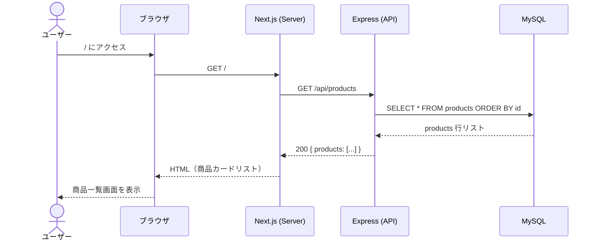
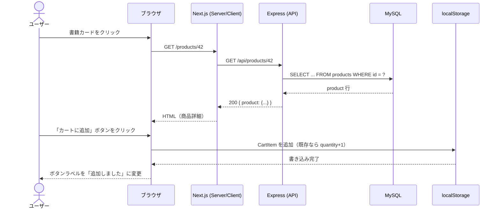
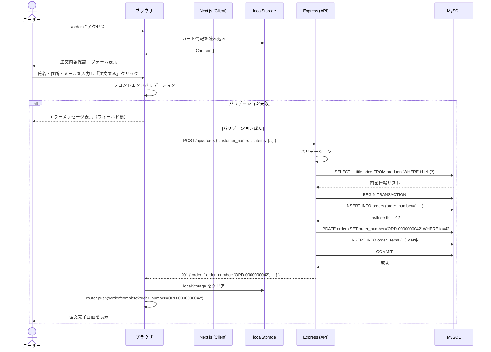
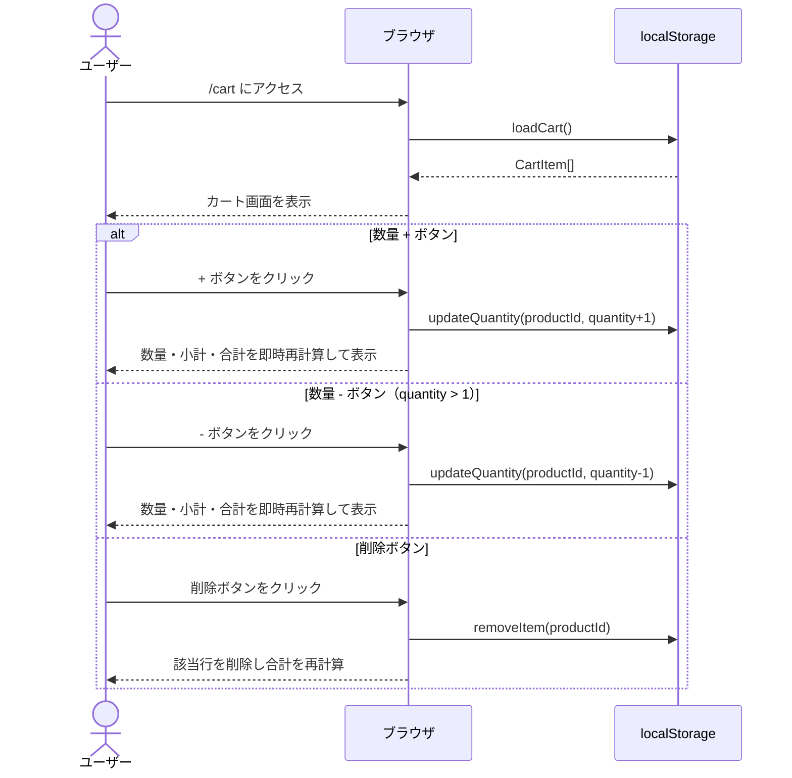

# 内部設計書

## ドキュメント情報

| 項目 | 内容 |
|---|---|
| ドキュメント名 | 内部設計書（個人運営オンライン書店 購買フロー） |
| 作成日 | 2026-05-12 |
| バージョン | 1.0.0 |
| 対象システム名 | 個人運営オンライン書店 購買フローWebアプリケーション |
| 参照外部設計書 | external_design.md |

---

## 1. 概要

### 1.1 本ドキュメントの目的

本ドキュメントは外部設計書（`external_design.md`）を受けて、開発者が実装に直接着手できるレベルの詳細を定義する内部設計書（詳細設計書）である。

外部設計書が「何を作るか（What）」を規定するのに対し、本書は「どのように作るか（How）」を規定する。ディレクトリ構成、TypeScript型定義、SQL DDL、APIの処理フロー、コンポーネント分割、状態管理ロジックを網羅し、本書のみを参照して実装が完結できることを目標とする。

### 1.2 対象読者

- フロントエンドエンジニア（Next.js / TypeScript）
- バックエンドエンジニア（Express / TypeScript / MySQL）
- 本プロジェクトの実装担当者全員

### 1.3 参照ドキュメント

| ドキュメント | 説明 |
|---|---|
| `external_design.md` | 外部設計書（画面・API・データモデル定義） |
| `user_requirements.md` | ユーザー要件定義書 |
| `CLAUDE.md` | プロジェクト開発ガイドライン |

---

## 2. システム構成詳細

### 2.1 全体アーキテクチャ

```
ブラウザ (http://localhost:3000)
    │
    │ HTTP/REST (JSON)
    ▼
┌─────────────────────────────────────────┐
│  Frontend: Next.js 14 + TypeScript      │
│  App Router (src/app/)                  │
│  port 3000                              │
└─────────────────────────────────────────┘
    │
    │ fetch (NEXT_PUBLIC_API_URL=http://localhost:4000)
    ▼
┌─────────────────────────────────────────┐
│  Backend: Express + TypeScript          │
│  エントリポイント: backend/src/index.ts │
│  port 4000                              │
└─────────────────────────────────────────┘
    │
    │ mysql2 (DB_HOST=mysql, port 3306)
    ▼
┌─────────────────────────────────────────┐
│  MySQL 8                                │
│  初期化SQL: mysql/init/01_init.sql      │
└─────────────────────────────────────────┘

3サービスをDocker Composeで管理
```

### 2.2 フロントエンドのディレクトリ構成

```
frontend/
├── src/
│   ├── app/                          # Next.js App Router ページ
│   │   ├── layout.tsx                # ルートレイアウト（共通ヘッダー含む）
│   │   ├── page.tsx                  # SCR-01: 商品一覧画面
│   │   ├── products/
│   │   │   └── [id]/
│   │   │       └── page.tsx          # SCR-02: 商品詳細画面
│   │   ├── cart/
│   │   │   └── page.tsx              # SCR-03: カート画面
│   │   └── order/
│   │       ├── page.tsx              # SCR-04: 注文フォーム画面
│   │       └── complete/
│   │           └── page.tsx          # SCR-05: 注文完了画面
│   ├── components/                   # 再利用可能なUIコンポーネント
│   │   ├── Header.tsx                # 共通ヘッダー（サイト名・カートアイコン）
│   │   ├── BookCard.tsx              # 商品一覧カード（SCR-01で使用）
│   │   ├── CartItemRow.tsx           # カート行（SCR-03で使用）
│   │   ├── OrderSummary.tsx          # 注文内容確認エリア（SCR-04で使用）
│   │   └── ErrorMessage.tsx          # エラーメッセージ表示
│   ├── hooks/
│   │   └── useCart.ts                # カートのlocalStorage操作カスタムフック
│   ├── lib/
│   │   └── api.ts                    # APIクライアント（ベースURL管理）
│   └── types/
│       └── index.ts                  # TypeScript型定義（集中管理）
├── public/
│   └── no-image.png                  # 書影未設定時のプレースホルダー画像
├── next.config.js                    # Next.js設定ファイル
├── tsconfig.json                     # TypeScript設定
└── package.json
```

### 2.3 バックエンドのディレクトリ構成

```
backend/
├── src/
│   ├── index.ts                      # エントリポイント（Expressアプリ初期化）
│   ├── routes/
│   │   ├── products.ts               # /api/products 系ルーター
│   │   └── orders.ts                 # /api/orders 系ルーター
│   ├── controllers/
│   │   ├── productsController.ts     # 商品関連ハンドラー
│   │   └── ordersController.ts       # 注文関連ハンドラー
│   ├── db/
│   │   ├── pool.ts                   # mysql2 接続プール設定
│   │   ├── productsQuery.ts          # 商品テーブルSQLクエリ関数
│   │   └── ordersQuery.ts            # 注文テーブルSQLクエリ関数
│   └── types/
│       └── index.ts                  # TypeScript型定義
├── tsconfig.json
└── package.json
```

### 2.4 MySQLのディレクトリ構成

```
mysql/
└── init/
    └── 01_init.sql                   # スキーマ定義・初期データ（起動時自動実行）
```

---

## 3. データベース設計

### 3.1 エンティティ関係

```
products (1) ────< order_items (>1) >──── orders (1)
```

- `products` は `order_items` を通じて `orders` と多対多の関係を持つ
- カート情報はDBに永続化しない（前提A：localStorageで管理）
- `order_items` には `title`・`price` を注文時点の値でスナップショット保存する（商品情報の事後変更に対する保護）

### 3.2 テーブル定義

#### 3.2.1 products テーブル

| カラム名 | 型 | 制約 | 説明 |
|---|---|---|---|
| id | INT | PK, AUTO_INCREMENT, NOT NULL | 商品ID |
| title | VARCHAR(255) | NOT NULL | 書名 |
| author | VARCHAR(255) | NOT NULL | 著者名 |
| price | INT | NOT NULL, CHECK (price >= 0) | 価格（円、税込み） |
| image_url | TEXT | NULL | 書影URL（任意） |
| description | TEXT | NULL | 商品説明文（任意） |
| created_at | TIMESTAMP | NOT NULL, DEFAULT CURRENT_TIMESTAMP | 作成日時 |
| updated_at | TIMESTAMP | NULL, DEFAULT NULL, ON UPDATE CURRENT_TIMESTAMP | 更新日時 |

#### 3.2.2 orders テーブル

| カラム名 | 型 | 制約 | 説明 |
|---|---|---|---|
| id | INT | PK, AUTO_INCREMENT, NOT NULL | 注文ID |
| order_number | VARCHAR(20) | NOT NULL, UNIQUE | 注文番号（ORD-0000000001形式） |
| customer_name | VARCHAR(100) | NOT NULL | 氏名 |
| customer_address | TEXT | NOT NULL | 住所 |
| customer_email | VARCHAR(255) | NOT NULL | メールアドレス |
| total_amount | INT | NOT NULL, CHECK (total_amount >= 0) | 合計金額（円） |
| created_at | TIMESTAMP | NOT NULL, DEFAULT CURRENT_TIMESTAMP | 注文日時 |
| updated_at | TIMESTAMP | NULL, DEFAULT NULL, ON UPDATE CURRENT_TIMESTAMP | 更新日時 |

#### 3.2.3 order_items テーブル

| カラム名 | 型 | 制約 | 説明 |
|---|---|---|---|
| id | INT | PK, AUTO_INCREMENT, NOT NULL | 行ID |
| order_id | INT | NOT NULL, FK(orders.id) | 注文ID |
| product_id | INT | NOT NULL, FK(products.id) | 商品ID |
| title | VARCHAR(255) | NOT NULL | 書名スナップショット |
| price | INT | NOT NULL | 価格スナップショット（円） |
| quantity | INT | NOT NULL, CHECK (quantity >= 1) | 数量 |
| subtotal | INT | NOT NULL | 小計（price × quantity） |
| created_at | TIMESTAMP | NOT NULL, DEFAULT CURRENT_TIMESTAMP | 作成日時 |

インデックス:
- `idx_order_items_order_id` → `order_id`
- `idx_order_items_product_id` → `product_id`

### 3.3 DDL（mysql/init/01_init.sql の内容）

```sql
-- ============================================================
-- MySQL 初期化スクリプト
-- docker-compose 起動時に自動実行されます
-- スキーマ変更時は docker compose down -v してから再起動してください
-- ============================================================

SET NAMES utf8mb4;

-- ============================================================
-- products テーブル
-- ============================================================
CREATE TABLE IF NOT EXISTS products (
  id          INT           NOT NULL AUTO_INCREMENT,
  title       VARCHAR(255)  NOT NULL,
  author      VARCHAR(255)  NOT NULL,
  price       INT           NOT NULL CHECK (price >= 0),
  image_url   TEXT          NULL,
  description TEXT          NULL,
  created_at  TIMESTAMP     NOT NULL DEFAULT CURRENT_TIMESTAMP,
  updated_at  TIMESTAMP     NULL     DEFAULT NULL ON UPDATE CURRENT_TIMESTAMP,
  PRIMARY KEY (id)
) ENGINE=InnoDB DEFAULT CHARSET=utf8mb4 COLLATE=utf8mb4_unicode_ci;

-- ============================================================
-- orders テーブル
-- ============================================================
CREATE TABLE IF NOT EXISTS orders (
  id               INT           NOT NULL AUTO_INCREMENT,
  order_number     VARCHAR(20)   NOT NULL,
  customer_name    VARCHAR(100)  NOT NULL,
  customer_address TEXT          NOT NULL,
  customer_email   VARCHAR(255)  NOT NULL,
  total_amount     INT           NOT NULL CHECK (total_amount >= 0),
  created_at       TIMESTAMP     NOT NULL DEFAULT CURRENT_TIMESTAMP,
  updated_at       TIMESTAMP     NULL     DEFAULT NULL ON UPDATE CURRENT_TIMESTAMP,
  PRIMARY KEY (id),
  UNIQUE KEY uq_orders_order_number (order_number)
) ENGINE=InnoDB DEFAULT CHARSET=utf8mb4 COLLATE=utf8mb4_unicode_ci;

-- ============================================================
-- order_items テーブル
-- ============================================================
CREATE TABLE IF NOT EXISTS order_items (
  id         INT          NOT NULL AUTO_INCREMENT,
  order_id   INT          NOT NULL,
  product_id INT          NOT NULL,
  title      VARCHAR(255) NOT NULL,
  price      INT          NOT NULL,
  quantity   INT          NOT NULL CHECK (quantity >= 1),
  subtotal   INT          NOT NULL,
  created_at TIMESTAMP    NOT NULL DEFAULT CURRENT_TIMESTAMP,
  PRIMARY KEY (id),
  CONSTRAINT fk_order_items_order_id
    FOREIGN KEY (order_id) REFERENCES orders (id),
  CONSTRAINT fk_order_items_product_id
    FOREIGN KEY (product_id) REFERENCES products (id),
  INDEX idx_order_items_order_id   (order_id),
  INDEX idx_order_items_product_id (product_id)
) ENGINE=InnoDB DEFAULT CHARSET=utf8mb4 COLLATE=utf8mb4_unicode_ci;

-- ============================================================
-- サンプルデータ（開発・動作確認用）
-- ============================================================
INSERT INTO products (title, author, price, description) VALUES
  ('Clean Code', 'Robert C. Martin', 3520, 'プログラマのためのクリーンコード入門。読みやすく保守しやすいコードを書くためのプラクティスを解説。'),
  ('Design Patterns', 'Gang of Four', 4950, 'オブジェクト指向設計における23のデザインパターンを解説した古典的名著。'),
  ('The Pragmatic Programmer', 'David Thomas, Andrew Hunt', 3080, 'ソフトウェア開発者としての実践的な思考法とツールを網羅した必読書。'),
  ('Refactoring', 'Martin Fowler', 4180, 'レガシーコードを安全かつ段階的に改善するためのリファクタリング手法を解説。'),
  ('Structure and Interpretation of Computer Programs', 'Harold Abelson, Gerald Jay Sussman', 3960, 'コンピュータサイエンスの古典。計算の本質を関数型の視点から丁寧に解説。');
```

---

## 4. バックエンド設計

### 4.1 ファイル構成と責務分離方針

レイヤーを以下の3層に分離し、関心事を明確にする。

| レイヤー | ディレクトリ | 責務 |
|---|---|---|
| ルーター | `src/routes/` | URLパスとHTTPメソッドのマッピング。コントローラーへのディスパッチのみ |
| コントローラー | `src/controllers/` | リクエスト検証・ビジネスロジック・レスポンス組み立て |
| DBアクセス | `src/db/` | パラメータ化クエリの実行。コントローラーからSQL文字列を分離 |

### 4.2 エントリポイント（backend/src/index.ts）

```typescript
import express from 'express';
import cors from 'cors';
import productsRouter from './routes/products';
import ordersRouter from './routes/orders';

const app = express();
const PORT = process.env.PORT || 4000;

// ミドルウェア設定
app.use(cors({ origin: 'http://localhost:3000' }));
app.use(express.json());

// ルーター登録
app.use('/api/products', productsRouter);
app.use('/api/orders', ordersRouter);

// 動作確認エンドポイント
app.get('/health', (_req, res) => {
  res.json({ status: 'ok' });
});

app.listen(PORT, () => {
  console.log(`Backend server is running on port ${PORT}`);
});
```

### 4.3 DBプール設定（backend/src/db/pool.ts）

mysql2 の接続プールを生成してエクスポートする。プールの再利用によりコネクション確立のオーバーヘッドを削減する。

```typescript
import mysql from 'mysql2/promise';

const pool = mysql.createPool({
  host:     process.env.DB_HOST     || 'localhost',
  port:     Number(process.env.DB_PORT || 3306),
  database: process.env.DB_NAME     || 'appdb',
  user:     process.env.DB_USER     || 'appuser',
  password: process.env.DB_PASSWORD || 'password',
  waitForConnections: true,
  connectionLimit:    10,
  queueLimit:         0,
});

export default pool;
```

### 4.4 エラーレスポンス形式

すべてのエラーレスポンスは以下の統一フォーマットで返す。

```typescript
// 成功: HTTP 200 or 201
{ "products": [...] }
{ "product": {...} }
{ "order": {...} }

// エラー: HTTP 4xx / 5xx
{
  "error": "エラーの概要（人間が読める文字列）",
  "details": ["フィールド別エラー1", "フィールド別エラー2"]  // 省略可、400時に付与
}
```

スタックトレースはレスポンスに含めず、`console.error()` でコンテナログにのみ出力する。

### 4.5 APIエンドポイント詳細

#### API-01: GET /api/products（商品一覧取得）

**ルーター:** `src/routes/products.ts`
```typescript
router.get('/', productsController.getProducts);
```

**コントローラー処理フロー（productsController.getProducts）:**

1. `getAllProducts()` を呼び出し
2. 取得結果を `{ products: ProductRow[] }` 形式で返す
3. DB例外が発生した場合は500を返す

**DBクエリ（productsQuery.getAllProducts）:**
```sql
SELECT id, title, author, price, image_url, description, created_at, updated_at
FROM products
ORDER BY id ASC;
```

**レスポンス:**

| ケース | ステータス | ボディ |
|---|---|---|
| 正常（0件含む） | 200 | `{ "products": [{ id, title, author, price, image_url, description }] }` |
| DBエラー | 500 | `{ "error": "Internal server error" }` |

---

#### API-02: GET /api/products/:id（商品詳細取得）

**ルーター:** `src/routes/products.ts`
```typescript
router.get('/:id', productsController.getProductById);
```

**コントローラー処理フロー（productsController.getProductById）:**

1. `req.params.id` を取得し `Number()` で変換する
2. `Number.isInteger(id) && id > 0` でなければ400を返す
3. `getProductById(id)` を呼び出す
4. 結果が `undefined`（0件）なら404を返す
5. 正常なら `{ product: ProductRow }` 形式で200を返す
6. DB例外が発生した場合は500を返す

**DBクエリ（productsQuery.getProductById）:**
```sql
SELECT id, title, author, price, image_url, description, created_at, updated_at
FROM products
WHERE id = ?;
```

**レスポンス:**

| ケース | ステータス | ボディ |
|---|---|---|
| 正常 | 200 | `{ "product": { id, title, author, price, image_url, description } }` |
| idが正の整数でない | 400 | `{ "error": "Invalid product id" }` |
| 商品が存在しない | 404 | `{ "error": "Product not found" }` |
| DBエラー | 500 | `{ "error": "Internal server error" }` |

---

#### API-03: POST /api/orders（注文作成）

**ルーター:** `src/routes/orders.ts`
```typescript
router.post('/', ordersController.createOrder);
```

**リクエストボディ:**
```typescript
{
  customer_name:    string;   // 必須・最大100文字
  customer_address: string;   // 必須・最大255文字
  customer_email:   string;   // 必須・RFC5322形式・最大255文字
  items: Array<{
    product_id: number;       // 必須・正の整数
    quantity:   number;       // 必須・1以上の整数
  }>;
}
```

**コントローラー処理フロー（ordersController.createOrder）:**

1. **バリデーション**
   - `customer_name`: 空文字または100文字超でエラー
   - `customer_address`: 空文字または255文字超でエラー
   - `customer_email`: 空文字、255文字超、またはRFC5322正規表現不一致でエラー
   - `items`: 空配列または各要素の `product_id` / `quantity` が正の整数でなければエラー
   - いずれか1つでもエラーがあれば `{ error: "Validation failed", details: [...] }` を返し400

2. **商品存在確認**
   - `items` の `product_id` 一覧でSELECT（IN句使用）
   - 取得件数が `items` のユニークな `product_id` 数と一致しなければ404を返す

3. **合計金額計算**
   - DBから取得した各商品の `price` と `quantity` を乗算して小計を算出
   - 全小計の合計を `total_amount` とする

4. **トランザクション開始**（`connection.beginTransaction()`）

5. **orders INSERT**
   - `order_number` は仮値 `''` でINSERT
   - `lastInsertId` を取得

6. **order_number 生成と UPDATE**
   - `order_number = 'ORD-' + lastInsertId.toString().padStart(10, '0')`
   - `UPDATE orders SET order_number = ? WHERE id = ?`

7. **order_items INSERT**
   - `items` の各要素について1行ずつINSERT
   - `title`・`price` は手順2で取得したDBの値（スナップショット）を使用

8. **コミット**（`connection.commit()`）

9. **レスポンス**
   - `{ "order": { id, order_number, customer_name, customer_email, total_amount, created_at } }` を201で返す

10. **ロールバック**
    - いずれかの手順で例外が発生した場合は `connection.rollback()` を実行し500を返す

**DBクエリ（ordersQuery 内）:**

```sql
-- 商品存在確認
SELECT id, title, price FROM products WHERE id IN (?);

-- 注文INSERT
INSERT INTO orders (order_number, customer_name, customer_address, customer_email, total_amount)
VALUES ('', ?, ?, ?, ?);

-- 注文番号UPDATE
UPDATE orders SET order_number = ? WHERE id = ?;

-- 注文明細INSERT（1行ずつ）
INSERT INTO order_items (order_id, product_id, title, price, quantity, subtotal)
VALUES (?, ?, ?, ?, ?, ?);
```

**レスポンス:**

| ケース | ステータス | ボディ |
|---|---|---|
| 正常 | 201 | `{ "order": { id, order_number, customer_name, customer_email, total_amount, created_at } }` |
| バリデーション失敗 | 400 | `{ "error": "Validation failed", "details": ["..."] }` |
| 存在しないproduct_id | 404 | `{ "error": "Product not found", "details": ["product_id: X"] }` |
| DBエラー | 500 | `{ "error": "Internal server error" }` |

---

#### API-04: GET /api/orders/:id（注文詳細取得・任意実装）

**ルーター:** `src/routes/orders.ts`
```typescript
router.get('/:id', ordersController.getOrderById);
```

**コントローラー処理フロー:**

1. `req.params.id` を正の整数に変換。不正なら400
2. `getOrderById(id)` でordersを取得。0件なら404
3. `getOrderItemsByOrderId(id)` でorder_itemsを取得
4. マージして `{ order: { ...order, items: [...] } }` 形式で200を返す

**DBクエリ:**
```sql
-- 注文取得
SELECT id, order_number, customer_name, customer_address, customer_email, total_amount, created_at
FROM orders
WHERE id = ?;

-- 注文明細取得
SELECT oi.product_id, oi.title, oi.price, oi.quantity, oi.subtotal
FROM order_items oi
WHERE oi.order_id = ?;
```

**レスポンス:**

| ケース | ステータス | ボディ |
|---|---|---|
| 正常 | 200 | `{ "order": { id, order_number, customer_name, customer_address, customer_email, total_amount, created_at, items: [{product_id, title, price, quantity, subtotal}] } }` |
| 注文が存在しない | 404 | `{ "error": "Order not found" }` |
| DBエラー | 500 | `{ "error": "Internal server error" }` |

### 4.6 CORS設定

```typescript
app.use(cors({
  origin: 'http://localhost:3000',
  methods: ['GET', 'POST'],
  allowedHeaders: ['Content-Type'],
}));
```

フロントエンド（`http://localhost:3000`）からのアクセスのみを許可する。

### 4.7 バリデーション実装詳細

メールアドレスのRFC5322検証に使用する正規表現:

```typescript
const EMAIL_REGEX = /^[^\s@]+@[^\s@]+\.[^\s@]+$/;
```

簡易RFC5322準拠として実装する。フルスペックの正規表現はメンテナンスコストが高く、フロントエンドとの重複検証であるため簡略化を許容する。

バリデーション結果は `details` 配列にフィールド名付きのメッセージを格納する。例:

```json
{
  "error": "Validation failed",
  "details": [
    "customer_name は必須です",
    "customer_email の形式が正しくありません"
  ]
}
```

---

## 5. フロントエンド設計

### 5.1 レンダリング戦略方針

| 画面 | コンポーネント種別 | データ取得方法 | 理由 |
|---|---|---|---|
| SCR-01（商品一覧） | Server Component | `fetch()` in async component | SEO・初期表示速度のため |
| SCR-02（商品詳細） | Server Component | `fetch()` in async component | 同上 |
| SCR-03（カート） | Client Component | `useEffect` + localStorage | カートはlocalStorageで管理するため |
| SCR-04（注文フォーム） | Client Component | useCart フック | フォーム操作・バリデーションが必要なため |
| SCR-05（注文完了） | Client Component | `useSearchParams()` | URLクエリパラメータ読み取りが必要なため |

### 5.2 型定義（frontend/src/types/index.ts）

```typescript
// ===== API レスポンス型 =====

/** 商品 */
export type Product = {
  id:          number;
  title:       string;
  author:      string;
  price:       number;
  image_url:   string | null;
  description: string | null;
};

/** 注文（POST /api/orders レスポンス） */
export type Order = {
  id:             number;
  order_number:   string;
  customer_name:  string;
  customer_email: string;
  total_amount:   number;
  created_at:     string;
};

/** 注文明細付き注文（GET /api/orders/:id レスポンス） */
export type OrderDetail = Order & {
  customer_address: string;
  items: OrderItem[];
};

/** 注文明細 */
export type OrderItem = {
  product_id: number;
  title:      string;
  price:      number;
  quantity:   number;
  subtotal:   number;
};

// ===== カート型 =====

/** localStorageに保存するカートアイテム */
export type CartItem = {
  product_id: number;
  title:      string;
  price:      number;
  quantity:   number;
};

// ===== API リクエスト型 =====

/** POST /api/orders リクエストボディ */
export type CreateOrderRequest = {
  customer_name:    string;
  customer_address: string;
  customer_email:   string;
  items: Array<{
    product_id: number;
    quantity:   number;
  }>;
};

// ===== フォーム型 =====

/** 注文フォームの入力値 */
export type OrderFormValues = {
  customer_name:    string;
  customer_address: string;
  customer_email:   string;
};

/** フォームバリデーションエラー */
export type FormErrors = Partial<Record<keyof OrderFormValues, string>>;

// ===== API エラー型 =====

/** バックエンドエラーレスポンス */
export type ApiError = {
  error:    string;
  details?: string[];
};
```

### 5.3 APIクライアント（frontend/src/lib/api.ts）

バックエンドURL（`NEXT_PUBLIC_API_URL`）の管理とfetchラッパーを集中管理する。

```typescript
import type { Product, Order, CreateOrderRequest } from '@/types';

const BASE_URL = process.env.NEXT_PUBLIC_API_URL || 'http://localhost:4000';

/** 商品一覧を取得する */
export async function fetchProducts(): Promise<Product[]> {
  const res = await fetch(`${BASE_URL}/api/products`, {
    cache: 'no-store',  // 常に最新データを取得
  });
  if (!res.ok) throw new Error(`Failed to fetch products: ${res.status}`);
  const data = await res.json();
  return data.products as Product[];
}

/** 商品詳細を取得する */
export async function fetchProduct(id: number): Promise<Product> {
  const res = await fetch(`${BASE_URL}/api/products/${id}`, {
    cache: 'no-store',
  });
  if (res.status === 404) throw new Error('Product not found');
  if (!res.ok) throw new Error(`Failed to fetch product: ${res.status}`);
  const data = await res.json();
  return data.product as Product;
}

/** 注文を作成する */
export async function createOrder(body: CreateOrderRequest): Promise<Order> {
  const res = await fetch(`${BASE_URL}/api/orders`, {
    method:  'POST',
    headers: { 'Content-Type': 'application/json' },
    body:    JSON.stringify(body),
  });
  if (!res.ok) {
    const err = await res.json();
    throw err;  // ApiError をそのままスロー
  }
  const data = await res.json();
  return data.order as Order;
}
```

### 5.4 カートのlocalStorage管理（frontend/src/hooks/useCart.ts）

カートの全操作を1つのカスタムフックに集約する。SSR環境での`localStorage`アクセスエラーを防ぐため、`useEffect`内でのみ読み書きを行う。

```typescript
'use client';

import { useState, useEffect, useCallback } from 'react';
import type { CartItem } from '@/types';

const CART_KEY = 'bookstore_cart';

/** localStorageからカートを読み込む（ブラウザ環境専用） */
function loadCart(): CartItem[] {
  try {
    const raw = localStorage.getItem(CART_KEY);
    return raw ? (JSON.parse(raw) as CartItem[]) : [];
  } catch {
    return [];
  }
}

/** localStorageにカートを書き込む */
function saveCart(items: CartItem[]): void {
  localStorage.setItem(CART_KEY, JSON.stringify(items));
}

export function useCart() {
  const [items, setItems] = useState<CartItem[]>([]);
  const [initialized, setInitialized] = useState(false);

  // マウント時にlocalStorageから読み込む
  useEffect(() => {
    setItems(loadCart());
    setInitialized(true);
  }, []);

  // items 変更時にlocalStorageへ書き込む（初期化完了後のみ）
  useEffect(() => {
    if (initialized) {
      saveCart(items);
    }
  }, [items, initialized]);

  /** カートに商品を追加する（既存商品なら数量を1加算） */
  const addItem = useCallback((product: { id: number; title: string; price: number }) => {
    setItems(prev => {
      const existing = prev.find(i => i.product_id === product.id);
      if (existing) {
        return prev.map(i =>
          i.product_id === product.id
            ? { ...i, quantity: i.quantity + 1 }
            : i
        );
      }
      return [...prev, {
        product_id: product.id,
        title:      product.title,
        price:      product.price,
        quantity:   1,
      }];
    });
  }, []);

  /** 数量を変更する（1未満には変更不可） */
  const updateQuantity = useCallback((productId: number, quantity: number) => {
    if (quantity < 1) return;
    setItems(prev =>
      prev.map(i => i.product_id === productId ? { ...i, quantity } : i)
    );
  }, []);

  /** 商品をカートから削除する */
  const removeItem = useCallback((productId: number) => {
    setItems(prev => prev.filter(i => i.product_id !== productId));
  }, []);

  /** カートを空にする（注文完了後に呼び出す） */
  const clearCart = useCallback(() => {
    setItems([]);
  }, []);

  /** 合計金額 */
  const totalAmount = items.reduce((sum, i) => sum + i.price * i.quantity, 0);

  /** カート内の総アイテム数（数量合計） */
  const totalCount = items.reduce((sum, i) => sum + i.quantity, 0);

  return {
    items,
    initialized,
    totalAmount,
    totalCount,
    addItem,
    updateQuantity,
    removeItem,
    clearCart,
  };
}
```

### 5.5 ページ設計

#### 5.5.1 SCR-01: 商品一覧画面（src/app/page.tsx）

- **コンポーネント種別:** Server Component（`async` function）
- **データ取得:** `fetchProducts()` をコンポーネント内で直接 `await`
- **表示内容:** BookCard コンポーネントのリスト
- **エラー処理:** `try-catch` でエラーをキャッチし、エラーメッセージを画面に表示

```typescript
// src/app/page.tsx（概略）
import { fetchProducts } from '@/lib/api';
import BookCard from '@/components/BookCard';

export default async function ProductListPage() {
  let products;
  try {
    products = await fetchProducts();
  } catch {
    return <ErrorMessage message="商品の読み込みに失敗しました。" />;
  }

  return (
    <main>
      <h1>書籍一覧</h1>
      <div className="product-grid">
        {products.map(p => <BookCard key={p.id} product={p} />)}
      </div>
    </main>
  );
}
```

#### 5.5.2 SCR-02: 商品詳細画面（src/app/products/[id]/page.tsx）

- **コンポーネント種別:** Server Component（`async` function）
- **データ取得:** `fetchProduct(Number(params.id))` を `await`
- **エラー処理:** 404は `notFound()` を呼び出し、それ以外はエラーメッセージ表示
- **カートへの追加:** クライアント操作のため `AddToCartButton` を Client Component として分離

```typescript
// src/app/products/[id]/page.tsx（概略）
import { fetchProduct } from '@/lib/api';
import { notFound } from 'next/navigation';
import AddToCartButton from '@/components/AddToCartButton';

type Props = { params: { id: string } };

export default async function ProductDetailPage({ params }: Props) {
  const id = Number(params.id);
  if (!Number.isInteger(id) || id <= 0) notFound();

  let product;
  try {
    product = await fetchProduct(id);
  } catch (e: unknown) {
    if (e instanceof Error && e.message === 'Product not found') notFound();
    return <ErrorMessage message="商品の読み込みに失敗しました。" />;
  }

  return (
    <main>
      {/* 商品情報表示（Server側でレンダリング） */}
      <h1>{product.title}</h1>
      <p>{product.author}</p>
      <p>¥{product.price.toLocaleString()}</p>
      <p>{product.description}</p>
      {/* カート追加ボタンはClient Component */}
      <AddToCartButton product={product} />
    </main>
  );
}
```

#### 5.5.3 SCR-03: カート画面（src/app/cart/page.tsx）

- **コンポーネント種別:** Client Component（`'use client'`）
- **データ取得:** `useCart()` フックから `items` を取得（localStorageから）
- **ハイドレーション対策:** `initialized` フラグが `false` の間はローディング表示（SSR/CSR不一致を防ぐ）

```typescript
// src/app/cart/page.tsx（概略）
'use client';

import { useCart } from '@/hooks/useCart';
import CartItemRow from '@/components/CartItemRow';
import Link from 'next/link';

export default function CartPage() {
  const { items, initialized, totalAmount, updateQuantity, removeItem } = useCart();

  if (!initialized) return <p>読み込み中...</p>;

  const isEmpty = items.length === 0;

  return (
    <main>
      <h1>カート</h1>
      {isEmpty ? (
        <p>カートに商品がありません。</p>
      ) : (
        <>
          {items.map(item => (
            <CartItemRow
              key={item.product_id}
              item={item}
              onUpdateQuantity={updateQuantity}
              onRemove={removeItem}
            />
          ))}
          <p>合計: ¥{totalAmount.toLocaleString()}</p>
        </>
      )}
      <Link href="/">商品一覧に戻る</Link>
      <Link
        href="/order"
        aria-disabled={isEmpty}
        style={{ pointerEvents: isEmpty ? 'none' : 'auto' }}
      >
        注文手続きへ進む
      </Link>
    </main>
  );
}
```

#### 5.5.4 SCR-04: 注文フォーム画面（src/app/order/page.tsx）

- **コンポーネント種別:** Client Component（`'use client'`）
- **データ取得:** `useCart()` フックから注文内容を取得
- **状態管理:** `useState` でフォーム入力値・バリデーションエラー・送信中フラグを管理
- **バリデーション:** `onBlur` イベントでフィールド単位の検証。送信時に全フィールドを再検証
- **遷移:** `createOrder()` が成功したら `clearCart()` を呼び、`router.push('/order/complete?order_number=...')` で遷移

```typescript
// src/app/order/page.tsx（概略）
'use client';

import { useState } from 'react';
import { useRouter } from 'next/navigation';
import { useCart } from '@/hooks/useCart';
import { createOrder } from '@/lib/api';
import type { OrderFormValues, FormErrors } from '@/types';

function validateField(name: keyof OrderFormValues, value: string): string | undefined {
  switch (name) {
    case 'customer_name':
      if (!value.trim()) return '氏名は必須です';
      if (value.length > 100) return '氏名は100文字以内で入力してください';
      break;
    case 'customer_address':
      if (!value.trim()) return '住所は必須です';
      if (value.length > 255) return '住所は255文字以内で入力してください';
      break;
    case 'customer_email': {
      if (!value.trim()) return 'メールアドレスは必須です';
      if (value.length > 255) return 'メールアドレスは255文字以内で入力してください';
      const EMAIL_REGEX = /^[^\s@]+@[^\s@]+\.[^\s@]+$/;
      if (!EMAIL_REGEX.test(value)) return 'メールアドレスの形式が正しくありません';
      break;
    }
  }
  return undefined;
}

export default function OrderPage() {
  const router = useRouter();
  const { items, initialized, totalAmount, clearCart } = useCart();

  const [form, setForm] = useState<OrderFormValues>({
    customer_name: '', customer_address: '', customer_email: '',
  });
  const [errors, setErrors] = useState<FormErrors>({});
  const [submitting, setSubmitting] = useState(false);
  const [apiError, setApiError] = useState<string | null>(null);

  const handleBlur = (name: keyof OrderFormValues) => {
    const error = validateField(name, form[name]);
    setErrors(prev => ({ ...prev, [name]: error }));
  };

  const handleSubmit = async (e: React.FormEvent) => {
    e.preventDefault();
    // 全フィールドバリデーション
    const newErrors: FormErrors = {};
    (Object.keys(form) as (keyof OrderFormValues)[]).forEach(name => {
      const err = validateField(name, form[name]);
      if (err) newErrors[name] = err;
    });
    if (Object.keys(newErrors).length > 0) {
      setErrors(newErrors);
      return;
    }

    setSubmitting(true);
    try {
      const order = await createOrder({
        ...form,
        items: items.map(i => ({ product_id: i.product_id, quantity: i.quantity })),
      });
      clearCart();
      router.push(`/order/complete?order_number=${order.order_number}`);
    } catch (err: unknown) {
      setApiError('注文の送信に失敗しました。しばらくしてから再度お試しください。');
    } finally {
      setSubmitting(false);
    }
  };

  if (!initialized) return <p>読み込み中...</p>;

  return (
    <main>
      {/* 注文内容確認エリア */}
      <OrderSummary items={items} totalAmount={totalAmount} />

      {/* 注文フォーム */}
      <form onSubmit={handleSubmit}>
        {/* 各フィールドのinput + エラーメッセージ */}
        {apiError && <p role="alert">{apiError}</p>}
        <button type="submit" disabled={submitting}>
          {submitting ? '送信中...' : '注文する'}
        </button>
      </form>
    </main>
  );
}
```

#### 5.5.5 SCR-05: 注文完了画面（src/app/order/complete/page.tsx）

- **コンポーネント種別:** Client Component（`'use client'`）
- **データ取得:** `useSearchParams()` で `order_number` クエリパラメータを読み取る
- **注意:** `useSearchParams()` は Next.js の `<Suspense>` でラップが必要

```typescript
// src/app/order/complete/page.tsx（概略）
'use client';

import { Suspense } from 'react';
import { useSearchParams } from 'next/navigation';
import Link from 'next/link';

function OrderCompleteContent() {
  const searchParams = useSearchParams();
  const orderNumber = searchParams.get('order_number') ?? '不明';

  return (
    <main>
      <h1>ご注文ありがとうございます</h1>
      <p>注文番号: {orderNumber}</p>
      <Link href="/">商品一覧へ戻る</Link>
    </main>
  );
}

export default function OrderCompletePage() {
  return (
    <Suspense fallback={<p>読み込み中...</p>}>
      <OrderCompleteContent />
    </Suspense>
  );
}
```

### 5.6 コンポーネント設計

#### Header（src/components/Header.tsx）

- **種別:** Client Component（カート数量バッジ表示のため）
- **責務:** サイト名の表示・カートアイコン（バッジ付き）へのリンク

```typescript
type Props = {
  // propsなし。useCart()を内部で呼び出す
};
```

#### BookCard（src/components/BookCard.tsx）

- **種別:** Server Component（クリックは `<Link>` で処理）
- **責務:** 書影・タイトル・著者名・価格の表示。クリックで `/products/[id]` へ遷移

```typescript
type Props = {
  product: Product;
};
```

#### AddToCartButton（src/components/AddToCartButton.tsx）

- **種別:** Client Component（`useCart` フック使用）
- **責務:** 「カートに追加」ボタン。クリック時に `addItem()` を呼び出す。追加後はボタンラベルを一時的に「追加しました」に変更しフィードバックを提供する

```typescript
type Props = {
  product: Product;
};
```

#### CartItemRow（src/components/CartItemRow.tsx）

- **種別:** Client Component（ボタン操作のため）
- **責務:** カート1行の表示（書名・単価・数量±ボタン・小計・削除ボタン）

```typescript
type Props = {
  item:             CartItem;
  onUpdateQuantity: (productId: number, quantity: number) => void;
  onRemove:         (productId: number) => void;
};
```

- 数量「-」ボタンは `item.quantity === 1` のとき `disabled` にする

#### OrderSummary（src/components/OrderSummary.tsx）

- **種別:** Server Component（表示のみ）
- **責務:** 注文内容確認エリアの表示（書名・数量・小計・合計）

```typescript
type Props = {
  items:       CartItem[];
  totalAmount: number;
};
```

#### ErrorMessage（src/components/ErrorMessage.tsx）

- **種別:** Server Component
- **責務:** エラーメッセージの統一表示

```typescript
type Props = {
  message: string;
};
```

### 5.7 ルートレイアウト（src/app/layout.tsx）

共通ヘッダーをルートレイアウトに組み込む。

```typescript
import Header from '@/components/Header';

export const metadata = {
  title: '個人書店',
  description: 'オンライン書店の購買フロー',
};

export default function RootLayout({ children }: { children: React.ReactNode }) {
  return (
    <html lang="ja">
      <body>
        <Header />
        {children}
      </body>
    </html>
  );
}
```

---

## 6. シーケンス図

### 6.1 商品一覧表示



### 6.2 商品詳細表示とカートへの追加



### 6.3 注文作成フロー



### 6.4 カート操作（数量変更・削除）



---

## 7. 実装上の注意事項

### 7.1 コーディング規約

| 対象 | 規約 |
|---|---|
| TypeScript/JavaScript | camelCase（変数・関数）、PascalCase（型・コンポーネント） |
| SQL カラム名 | snake_case |
| APIパスパラメータ | snake_case（例: `customer_name`） |
| ファイル名（コンポーネント） | PascalCase（例: `BookCard.tsx`） |
| ファイル名（その他） | camelCase（例: `api.ts`, `useCart.ts`） |
| インポート | `@/` エイリアス使用（`tsconfig.json` の `paths` 設定が必要） |

`tsconfig.json`（フロントエンド）への追記:
```json
{
  "compilerOptions": {
    "paths": {
      "@/*": ["./src/*"]
    }
  }
}
```

### 7.2 エッジケースとバリデーション

| ケース | 対処 |
|---|---|
| カートが空の状態で `/order` に直接アクセス | カートが空（`items.length === 0`）なら `/cart` へリダイレクト |
| `useSearchParams()` の SSR エラー | `<Suspense>` でラップ必須（Next.js 14 の制約） |
| SSR時の localStorage アクセス | `useEffect` 内のみでアクセス。`initialized` フラグでガード |
| 商品詳細画面での非整数ID | コントローラーで `Number.isInteger()` チェック後400を返す |
| カートアイテムのprice変更 | localStorageのスナップショットを使用。商品詳細から再度「カートに追加」した場合は `addItem` が `quantity+1` するのみで price は更新しない（仕様上、価格は変動しない前提） |
| 注文作成時にitemsが空 | バリデーションで `items.length === 0` のとき400を返す |

### 7.3 セキュリティ

| 項目 | 実装方針 |
|---|---|
| SQLインジェクション対策 | mysql2 のプリペアドステートメント（`?` プレースホルダー）を徹底使用。SQL文字列への直接変数埋め込みは禁止 |
| XSS対策 | `dangerouslySetInnerHTML` の使用禁止。Reactのデフォルトエスケープを活用 |
| CORS | `http://localhost:3000` のみ許可 |
| 秘密情報 | `.env` ファイルに記載し `.gitignore` に追加。`NEXT_PUBLIC_` プレフィックスなしの変数はサーバー側のみ参照 |
| スタックトレース | エラーレスポンスに含めない。`console.error()` でログ出力のみ |

### 7.4 パフォーマンス

| 項目 | 対策 |
|---|---|
| 商品一覧・詳細 | Server Componentで初期レンダリングし、TTIを短縮 |
| カート操作 | localStorageのみ操作するため100ms以内が期待できる |
| DB接続 | mysql2 の接続プールを使用して接続確立コストを削減 |
| 書影未設定 | `image_url` が `null` の場合は `public/no-image.png` を表示 |

### 7.5 価格表示

- すべての価格は税込みとして扱う（税率計算不要、前提F）
- 表示時は `price.toLocaleString()` を使用して3桁区切りカンマを付ける（例: `¥3,520`）
- バックエンドでの価格単位は円（INTEGER型、小数なし）

---

## 8. 環境変数・設定ファイルの実装詳細

### 8.1 .env.example（プロジェクトルート）

現在の `.env.example` を本設計に沿って維持する。変更は不要。

```env
# MySQL
MYSQL_ROOT_PASSWORD=rootpassword
DB_NAME=appdb
DB_USER=appuser
DB_PASSWORD=password

# Backend
NODE_ENV=development
PORT=4000

# Frontend
NEXT_PUBLIC_API_URL=http://localhost:4000
```

### 8.2 docker-compose.yml の環境変数マッピング

| サービス | 環境変数 | 参照元 |
|---|---|---|
| backend | `DB_HOST=mysql` | docker-compose.yml 固定値（コンテナ名） |
| backend | `DB_PORT=3306` | docker-compose.yml 固定値 |
| backend | `DB_NAME` | `.env` の `DB_NAME` |
| backend | `DB_USER` | `.env` の `DB_USER` |
| backend | `DB_PASSWORD` | `.env` の `DB_PASSWORD` |
| frontend | `NEXT_PUBLIC_API_URL` | `http://localhost:4000`（docker-compose.yml 固定値） |

**注意:** `NEXT_PUBLIC_API_URL` はブラウザ側で実行されるため `http://localhost:4000` が正しい。コンテナ内の名前解決（`http://backend:4000`）はサーバー側レンダリング時には使用できるが、クライアント側（CSR）からは `localhost:4000` でアクセスする必要がある。本プロジェクトではすべてのfetchをブラウザのコンテキストで実行するため `http://localhost:4000` を使用する。

### 8.3 next.config.js

特別な設定は不要だが、将来的な拡張に備えてファイルを用意する。

```javascript
// frontend/next.config.js
/** @type {import('next').NextConfig} */
const nextConfig = {};

module.exports = nextConfig;
```

### 8.4 tsconfig.json（フロントエンド）への追記

`@/` インポートエイリアスを有効にするために `paths` を追加する。

```json
{
  "compilerOptions": {
    "paths": {
      "@/*": ["./src/*"]
    }
  }
}
```

---

## 9. 実装順序

以下の順序で実装することを推奨する。各ステップの成果物が次のステップの前提となる。

### ステップ1: データベース初期化（推定: 0.5時間）

1. `mysql/init/01_init.sql` を本設計書の§3.3 DDLで置き換える
2. `docker compose down -v && docker compose up --build` で動作確認
3. `docker compose exec mysql mysql -u appuser -ppassword appdb -e "SHOW TABLES;"` で3テーブルを確認

### ステップ2: バックエンド基盤（推定: 1時間）

1. `backend/src/db/pool.ts` を作成（DBプール設定）
2. `backend/src/types/index.ts` を作成（TypeScript型定義）
3. `backend/src/index.ts` を更新（CORS設定・ルーター登録）

### ステップ3: 商品APIの実装（推定: 1時間）

1. `backend/src/db/productsQuery.ts` を作成
2. `backend/src/controllers/productsController.ts` を作成
3. `backend/src/routes/products.ts` を作成
4. `curl http://localhost:4000/api/products` で動作確認

### ステップ4: 注文APIの実装（推定: 2時間）

1. `backend/src/db/ordersQuery.ts` を作成（トランザクション処理含む）
2. `backend/src/controllers/ordersController.ts` を作成
3. `backend/src/routes/orders.ts` を作成
4. `curl -X POST http://localhost:4000/api/orders ...` で動作確認

### ステップ5: フロントエンド基盤（推定: 1時間）

1. `frontend/src/types/index.ts` を作成（TypeScript型定義）
2. `frontend/src/lib/api.ts` を作成（APIクライアント）
3. `frontend/src/hooks/useCart.ts` を作成（カスタムフック）
4. `frontend/tsconfig.json` に `@/` エイリアスを追加
5. `frontend/src/app/layout.tsx` を更新（Header組み込み）

### ステップ6: 商品一覧・詳細画面（推定: 1.5時間）

1. `frontend/src/components/BookCard.tsx` を作成
2. `frontend/src/components/AddToCartButton.tsx` を作成
3. `frontend/src/app/page.tsx` を実装（SCR-01）
4. `frontend/src/app/products/[id]/page.tsx` を実装（SCR-02）

### ステップ7: カート画面（推定: 1時間）

1. `frontend/src/components/CartItemRow.tsx` を作成
2. `frontend/src/app/cart/page.tsx` を実装（SCR-03）

### ステップ8: 注文フォーム・完了画面（推定: 1.5時間）

1. `frontend/src/components/OrderSummary.tsx` を作成
2. `frontend/src/app/order/page.tsx` を実装（SCR-04）
3. `frontend/src/app/order/complete/page.tsx` を実装（SCR-05）

### ステップ9: 結合テスト（推定: 1時間）

1. 商品一覧→詳細→カート→注文フォーム→完了の購買フロー全体を通しで確認
2. カート空状態での「注文手続きへ進む」ボタンの非活性を確認
3. バリデーションエラーの表示を確認
4. 注文完了画面での注文番号表示を確認

---

## 10. 設計上の前提・注意事項

### 前提条件のまとめ

| ID | 前提条件 | 影響箇所 |
|---|---|---|
| 前提A | カートはlocalStorageで管理（DBなし） | useCart フック、DBスキーマ |
| 前提B | 数量「-」は quantity=1 のとき disabled | CartItemRow コンポーネント |
| 前提C | メール送信はスコープ外 | ordersController（送信処理なし） |
| 前提D | 注文番号はURLクエリパラメータ `/order/complete?order_number=ORD-...` | SCR-05、SCR-04の遷移処理 |
| 前提E | スマホ対応はMVP必須外 | スタイリング（レスポンシブ不要） |
| 前提F | 価格は税込み表示、税計算なし | バックエンド計算ロジック |
| 前提G | 注文番号 = `ORD-` + 10桁ゼロ埋めID | ordersController のorder_number生成 |

### 実装で注意すべき点

1. **Server ComponentとClient Componentの混在**: `useCart` フックはClient Componentでのみ使用可能。Server Component内で誤って使用するとビルドエラーになる
2. **`useSearchParams()` のSuspense要件**: Next.js 14ではuseSearchParams()を使用するコンポーネントをSuspenseでラップしないとビルド時警告が発生する
3. **トランザクション内でのコネクション管理**: プールから取得した `connection` をトランザクション全体で同一オブジェクトを使い続け、finally節で `connection.release()` を呼ぶ
4. **注文番号のINSERT戦略**: `order_number` は `NOT NULL UNIQUE` だが、INSERTのとき仮値 `''` を使う点に注意。並行リクエストで `''` の重複が起きないよう、トランザクション内でINSERT直後にUPDATEすることで一意性を確保する（別解: `order_number` カラムをNULLableにして後でUPDATEする方法もある）
